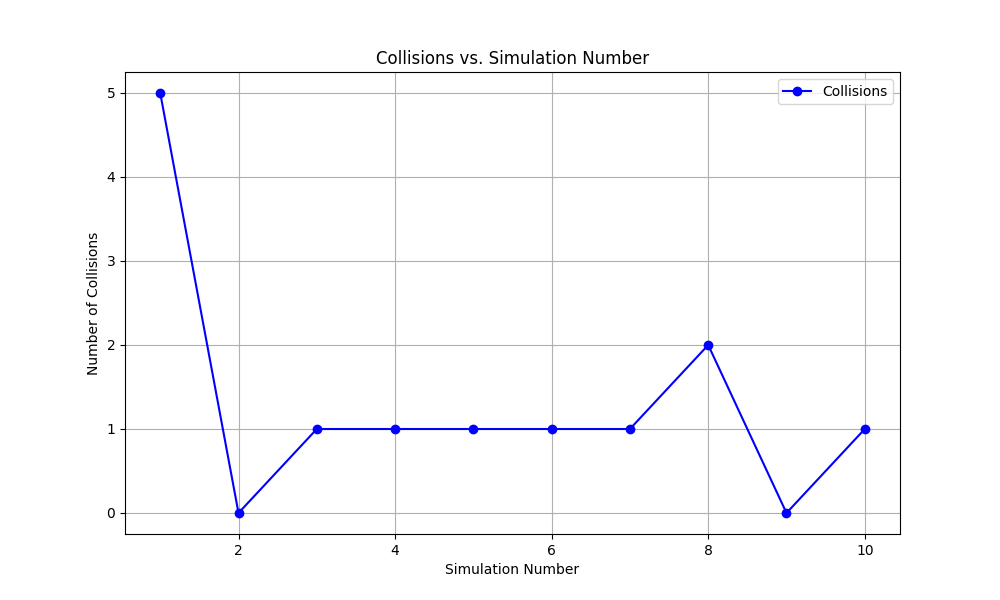
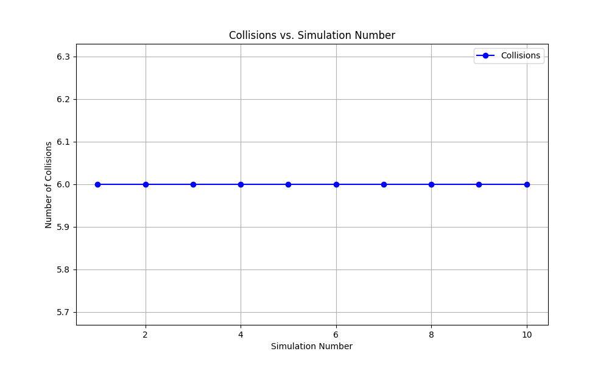
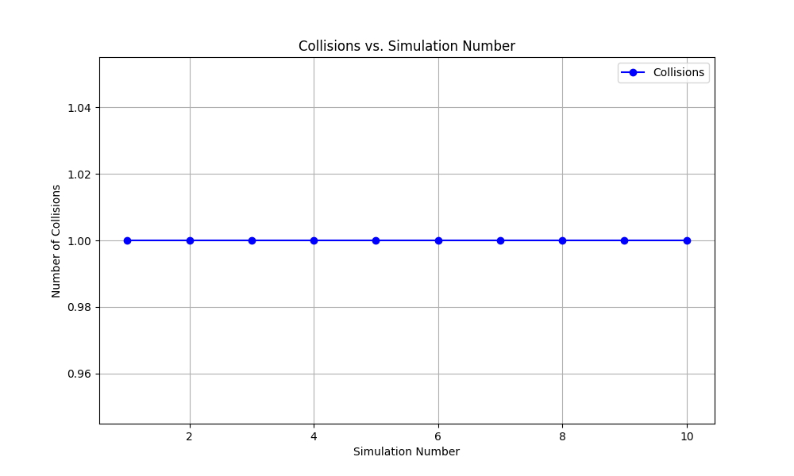

# Self-Driving Car Simulation: Path Planning and Camera Enhancements

This project builds on the repository [ENPM661 Project 5](https://github.com/BrianBock/ENPM661-Project-5), which implements the various path-planning algorithms for a self-driving car, including:
- **RRT** (Rapidly-Exploring Random Tree)
- **A\*** (A-Star)
- **Dijkstra**
- **BFS** (Breadth-First Search)
- **DFS** (Depth-First Search)

## My Contributions
- **Sky View Mode**:
  - Added a new camera mode that provides a fixed, bird's-eye view of the entire track for better visualization of simulations.
  
- **Algorithm Simulations**:
  - Ran simulations for other grid-based planners (A*, Dijkstra, BFS, DFS) and evaluated their performance across different number of simulations
  
### Performance Graphs
#### 1. **RRT Performance**
  - 
    
#### 2. **A* Performance**

#### 3. **Dijkstra Performance**

#### 4. **Breadth-First Search Performance**

#### 5. **Depth-First Search Performance**

- **Next Steps:
  - Use Reinforcement Learning to fine-tune parameters for all the various path-planning algorithms I implemented. 
